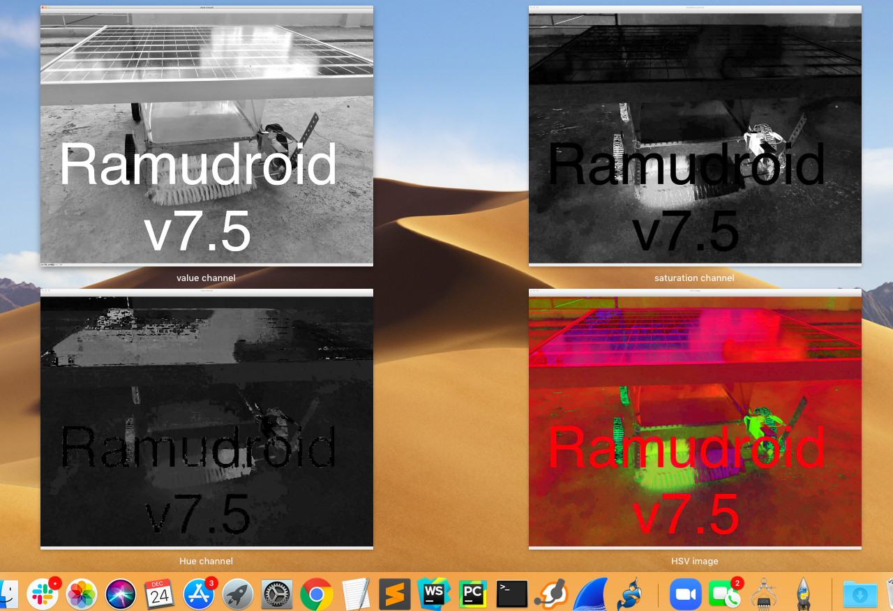
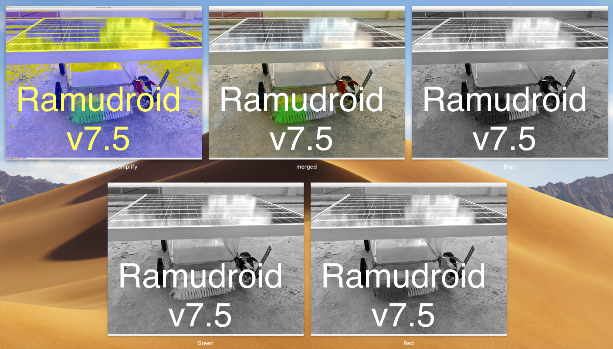
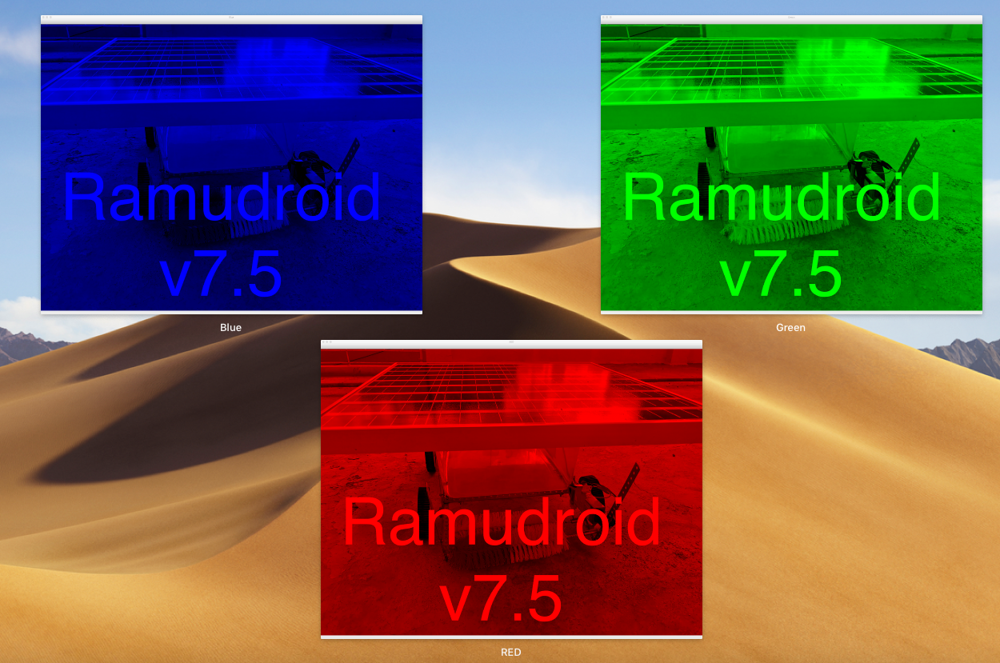

# Computer vision libs and techniques for Ramudroid 

## Raspiberry Pi camera module 

Raspberry Pi Camera find applications in areas from robotics to home automation.
applications provided: raspistill, raspivid, raspiyuv and raspividyuv

### Deep Learning 

Google’s TensorFlow is a  python library for Deep Learning. 
It can be used for image recognition, face detection, natural language processing etc
2 methods to install TensorFlow on Raspberry Pi:
- TensorFlow for CPU
- TensorFlow for Edge TPU Co-Processor

Install deeplearning libs
```
pip3 install tensorflow
pip3 install keras
```
### Computer vision 

Opencv (cv2 lib in python ) is used for computer vision , it captures and trabsforms the pictures.
numpy andmatpob are use for image preocesisng and rendering along with it

```
sudo apt-get install libhdf5-dev -y && sudo apt-get install libhdf5-serial-dev -y && sudo apt-get install libatlas-base-dev -y && sudo apt-get install libjasper-dev -y && sudo apt-get install libqtgui4 -y && sudo apt-get install libqt4-test -y
pip3 install opencv-python
pip3 install matplotlib
```

### Models 

**Retina net**

Can detect upto 80 diff objects 

person, bicycle, car, motorcycle, airplane, bus, train, truck, boat, traffic light, fire hydrant, stop_sign,
parking meter,   bench,   bird,   cat,   dog,   horse,   sheep,   cow,   elephant,   bear,   zebra,
giraffe,   backpack,   umbrella,   handbag,   tie,   suitcase,   frisbee,   skis,   snowboard,
sports ball,   kite,   baseball bat,   baseball glove,   skateboard,   surfboard,   tennis racket,
bottle,   wine glass,   cup,   fork,   knife,   spoon,   bowl,   banana,   apple,   sandwich,   orange,
broccoli,   carrot,   hot dog,   pizza,   donot,   cake,   chair,   couch,   potted plant,   bed,
dining table,   toilet,   tv,   laptop,   mouse,   remote,   keyboard,   cell phone,   microwave,
oven,   toaster,   sink,   refrigerator,   book,   clock,   vase,   scissors,   teddy bear,   hair dryer,
toothbrush. 
```bash
wget https://github.com/OlafenwaMoses/ImageAI/releases/download/1.0/resnet50_coco_best_v2.0.1.h5
```

## Run 
To detect an objet and draw box to identify it  
```
python3 detect.py
```
sample results in outputs folder 


# Image processing in openCV

Examples programs using opencv 
- Finding pixel of image
- Gray scale an image 
- Color Space depiction

## Mixing color intensities for spectrum range

Mixing different intensities of each color gives us the full spectrum
example : 
Black 
    Red - 0 , Green - 0 , Blue -0 
white 
    Red - 255 , Green - 255 , Blue -255
yellow
    Red – 255; Green – 255; Blue – 0

### RGB calculation 

Formula for finding HEX value of a color
```
RGB = ( R * 65536 ) + ( G * 256 ) + B 
```
when R (RED) , G  (GREEN) and B (BLUE)

example :
white 
since R , G and B are all 255
255*65536 + 255*256 + 255 = 16777215
Decimal to Hex conversion #FFFFFF

**Outputs**




## Storing images 

Images are stored in multi-dimensional arrays.
color images in 3D 
gray scale  (0,255), (0,255)  in 2D
binary images (pixel either black or white) are stored in 2D array too

### 3x3 grid , image detetion on centre box 

dividing image into 3x3 grid 


sample 


perform image detection on box-5

### 3x2 grid , edge detection on bottom centre box 

dividing image into 3x2 grid 


sample 


## Canny Edge Detection

Perform edge detection on box-5

Initial edge detection using canny edge method doesnt give satisfactory result in evaluating edges


Edge Detection after adding sharpness filter using GaussianBlur


**Ref**
- https://circuitdigest.com/
- https://github.com/opencv/opencv
- https://docs.opencv.org/master/d9/df8/tutorial_root.html
- https://learning.oreilly.com/library/view/computer-vision-with/


## debug 

**Issue 1**  No module named cv2
**Solution**
```bash
pip3 install opencv-python
```


**Issue1** Traceback (most recent call last):
  File "detect.py", line 1, in <module>
    import cv2
ImportError: No module named cv2
**Solution** Install opencv-python . Also upgrade pip if required. I used pipv19.2.3
```
sudo pip3 install opencv-python cvlib
```

**Issue2**Traceback (most recent call last):
  File "detect.py", line 2, in <module>
    import matplotlib.pyplot as plt
ModuleNotFoundError: No module named 'matplotlib'
**solution** Install matplotlib python module 
```
sudo pip3 install matplotlib
```

**Issue3**   File "detect.py", line 4, in <module>
    import cv2
  File "/home/pi/.local/lib/python3.7/site-packages/cv2/__init__.py", line 3, in <module>
    from .cv2 import *
ImportError: /home/pi/.local/lib/python3.7/site-packages/cv2/cv2.cpython-37m-arm-linux-gnueabihf.so: undefined symbol: __atomic_fetch_add_8
 **Solution** Get opencv in python 3  
```
sudo pip3 install opencv-contrib-python libwebp6
sudo apt install libqt4-test
```
then
```
sudo python3 -c "import cv2"
```

