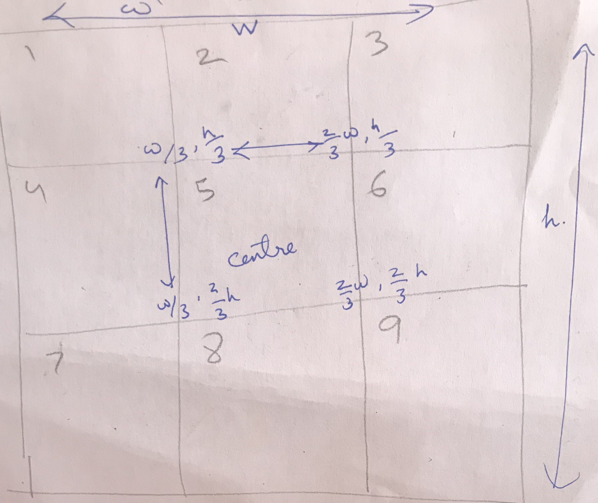
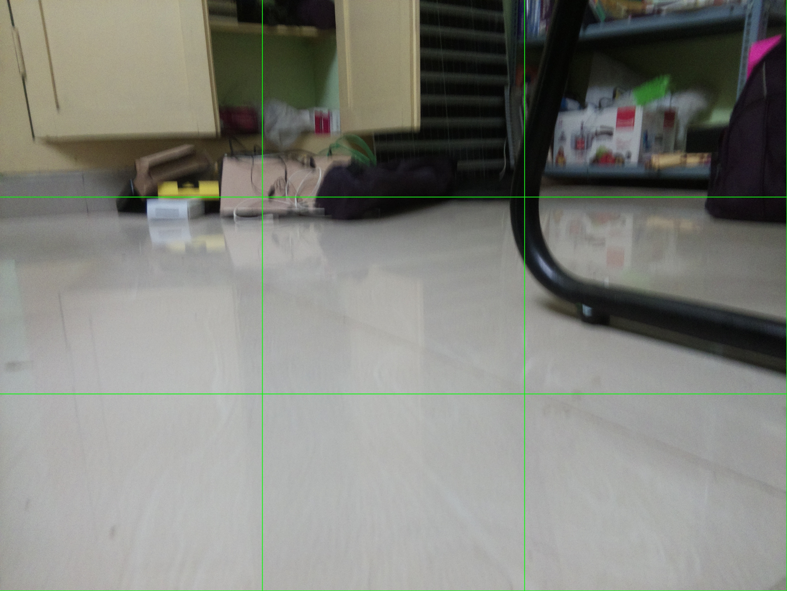
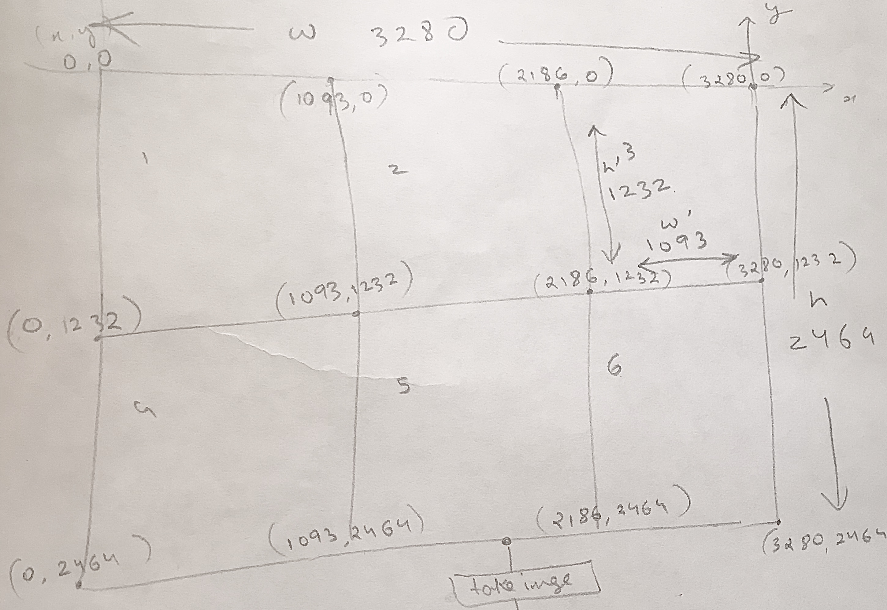
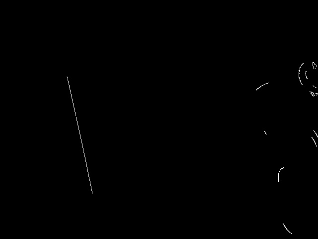
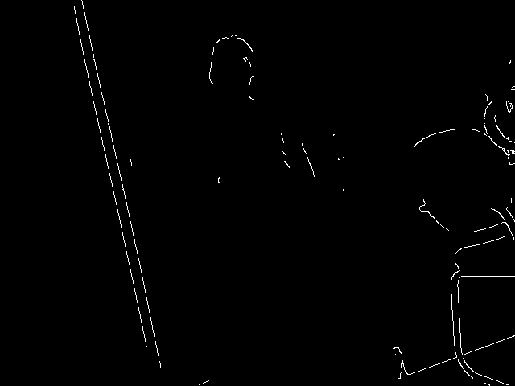

# Computer vision libs and techniques for Ramudroid 

## Raspberry Pi camera module 

Raspberry Pi Camera find applications in areas from robotics to home automation.
applications provided: raspistill, raspivid, raspiyuv and raspividyuv

### Deep Learning 

Google’s TensorFlow is a python library for Deep Learning. 
It can be used for image recognition, face detection, natural language processing etc
2 methods to install TensorFlow on Raspberry Pi:
- TensorFlow for CPU
- TensorFlow for Edge TPU Co-Processor

Install deep-learning libraries tensorflow and keras 
```
pip3 install tensorflow
pip3 install keras
```
### OpenCV

Opencv (cv2 lib in python ) is used for computer vision , it captures and trabsforms the pictures.
numpy and matplotlib are use for image pre-processing and rendering along with it

```
sudo apt-get install libhdf5-dev -y && sudo apt-get install libhdf5-serial-dev -y && sudo apt-get install libatlas-base-dev -y && sudo apt-get install libjasper-dev -y && sudo apt-get install libqtgui4 -y && sudo apt-get install libqt4-test -y
pip3 install opencv-python
pip3 install matplotlib
```

### Models 

**Retina net**

Can detect upto 80 diff objects 

person, bicycle, car, motorcycle, airplane, bus, train, truck, boat, traffic light, fire hydrant, stop_sign,
parking meter,   bench,   bird,   cat,   dog,   horse,   sheep,   cow,   elephant,   bear,   zebra,
giraffe,   backpack,   umbrella,   handbag,   tie,   suitcase,   frisbee,   skis,   snowboard,
sports ball,   kite,   baseball bat,   baseball glove,   skateboard,   surfboard,   tennis racket,
bottle,   wine glass,   cup,   fork,   knife,   spoon,   bowl,   banana,   apple,   sandwich,   orange,
broccoli,   carrot,   hot dog,   pizza,   donot,   cake,   chair,   couch,   potted plant,   bed,
dining table,   toilet,   tv,   laptop,   mouse,   remote,   keyboard,   cell phone,   microwave,
oven,   toaster,   sink,   refrigerator,   book,   clock,   vase,   scissors,   teddy bear,   hair dryer,
toothbrush. 
```bash
wget https://github.com/OlafenwaMoses/ImageAI/releases/download/1.0/resnet50_coco_best_v2.0.1.h5
```

## Run 
To detect an object and draw box to identify it  
```
python3 detect.py
```
sample results in outputs folder 


### 3x3 grid , image detection on centre box 

dividing image into 3x3 grid 



sample 


perform image detection on box-5

### 3x2 grid , edge detection on bottom centre box 

dividing image into 3x2 grid 



sample 


## Canny Edge Detection

Perform edge detection on box-5

Initial edge detection using canny edge method doesnt give satisfactory result in evaluating edges


Edge Detection after adding sharpness filter using GaussianBlur


**Ref**
- https://circuitdigest.com/
- https://github.com/opencv/opencv
- https://docs.opencv.org/master/d9/df8/tutorial_root.html
- https://learning.oreilly.com/library/view/computer-vision-with/