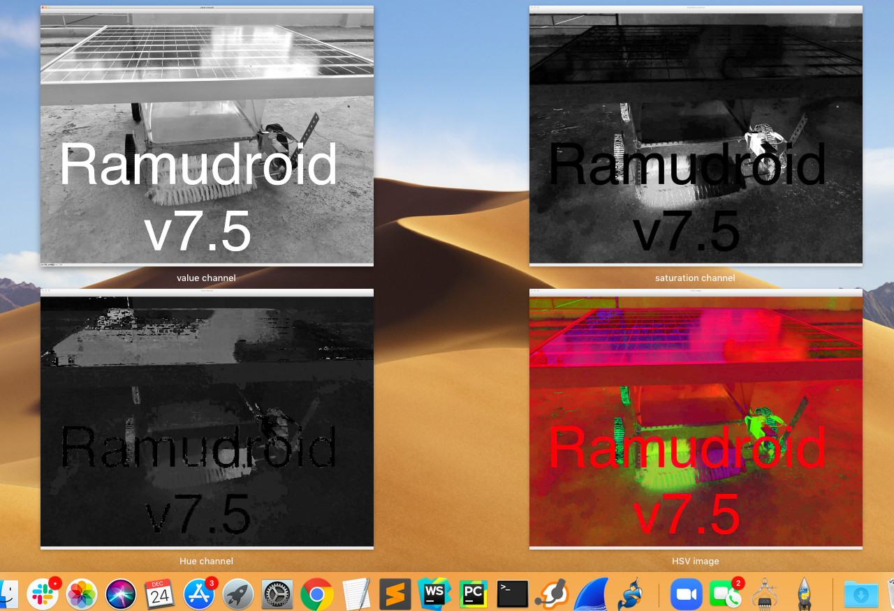
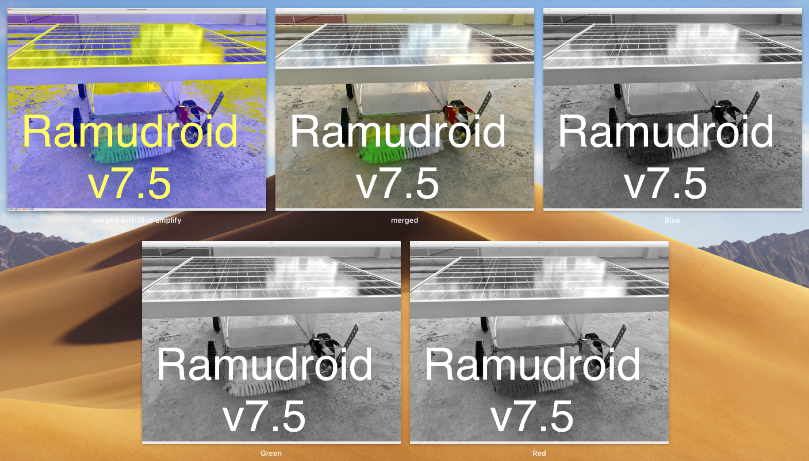
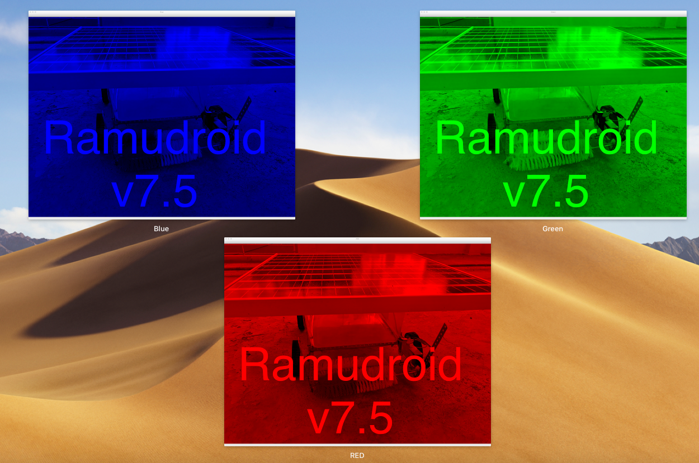

# Image processing in openCV

Examples programs using opencv 
- Finding pixel of image
- Gray scale an image 
- Color Space depiction

## Mixing color intensities for spectrum range

Mixing different intensities of each color gives us the full spectrum
example : 
Black 
    Red - 0 , Green - 0 , Blue -0 
white 
    Red - 255 , Green - 255 , Blue -255
yellow
    Red – 255; Green – 255; Blue – 0

### RGB calculation 

Formula for finding HEX value of a color
```
RGB = ( R * 65536 ) + ( G * 256 ) + B 
```
when R (RED) , G  (GREEN) and B (BLUE)

example :
white 
since R , G and B are all 255
255*65536 + 255*256 + 255 = 16777215
Decimal to Hex conversion #FFFFFF

**Outputs**






## Storing images 

Images are stored in multi-dimensional arrays.
color images in 3D 
gray scale  (0,255), (0,255)  in 2D
binary images (pixel either black or white) are stored in 2D array too

## debug 

**Issue 1**  No module named cv2
\
**Solution**
```bash
pip3 install opencv-python
```

**Issue2** Traceback (most recent call last):
  File "detect.py", line 1, in <module>
    import cv2
ImportError: No module named cv2
\
**Solution** Install opencv-python . Also upgrade pip if required. I used pipv19.2.3
```
sudo pip3 install opencv-python cvlib
```

**Issue3** Traceback (most recent call last):
  File "detect.py", line 2, in <module>
    import matplotlib.pyplot as plt
ModuleNotFoundError: No module named 'matplotlib'
\
**solution** Install matplotlib python module 
```
sudo pip3 install matplotlib
```

**Issue3** Import error
```
File "detect.py", line 4, in <module>
    import cv2
  File "/home/pi/.local/lib/python3.7/site-packages/cv2/__init__.py", line 3, in <module>
    from .cv2 import *
ImportError: /home/pi/.local/lib/python3.7/site-packages/cv2/cv2.cpython-37m-arm-linux-gnueabihf.so: undefined symbol: __atomic_fetch_add_8
```
\
**Solution** Get opencv in python 3  
```
sudo pip3 install opencv-contrib-python libwebp6
sudo apt install libqt4-test
```
then
```
sudo python3 -c "import cv2"
```