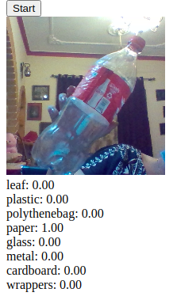
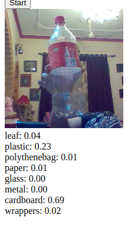
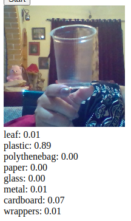
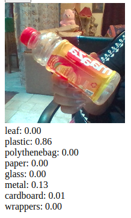

# Pre-Trained Litter detection Model

Video based object detection 


## False positives 





## True Positives 





## Webrtc constraints 

```json
{
    audio: false,
    video: {
        width: {min: 640, ideal: 1280, max: 1920},
        height: {min: 480, ideal: 720, max: 1080},
        frameRate: {ideal: 24}
    }
}
```

## Tensolflow setup 

Setting up tensorflow enviornment in local virtual env
```shell script
python3 -m venv --system-site-packages ./venv
source ./venv/bin/activate 
source ./venv/bin/activate.csh
pip install --upgrade pip
pip list
pip install --upgrade tensorflow
```

Verify the install 
```shell script
python -c "import tensorflow as tf;print(tf.reduce_sum(tf.random.normal([1000, 1000])))"
```

## GPU Nvidia CUDA and CcuDNN support 


Install CUPTI which ships with the CUDA® Toolkit. Append its installation directory to the $LD_LIBRARY_PATH environmental variable:
```shell script
export LD_LIBRARY_PATH=$LD_LIBRARY_PATH:/usr/local/cuda/extras/CUPTI/lib64
``` 

## Debugging 

**Issue1** permission denied in virtualenv
```shell script

```
\
**solution** do not create virtual env with sudo this creates issues inside of virtual env 


**References**

- Tensorflow installation - https://www.tensorflow.org/install/gpu


