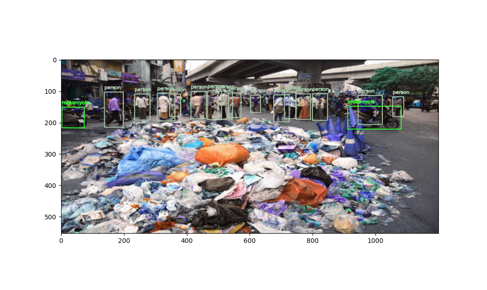
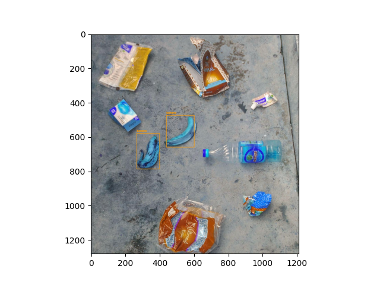

# RealTime detection of common objects from coco dataset 

It uses YOLOv3 model trained on COCO dataset capable of detecting 80 common objects in context.

person, bicycle, car, motorcycle, airplane, bus, train, truck, boat, traffic light, fire hydrant, stop_sign,
parking meter,   bench,   bird,   cat,   dog,   horse,   sheep,   cow,   elephant,   bear,   zebra,
giraffe,   backpack,   umbrella,   handbag,   tie,   suitcase,   frisbee,   skis,   snowboard,
sports ball,   kite,   baseball bat,   baseball glove,   skateboard,   surfboard,   tennis racket,
bottle,   wine glass,   cup,   fork,   knife,   spoon,   bowl,   banana,   apple,   sandwich,   orange,
broccoli,   carrot,   hot dog,   pizza,   donot,   cake,   chair,   couch,   potted plant,   bed,
dining table,   toilet,   tv,   laptop,   mouse,   remote,   keyboard,   cell phone,   microwave,
oven,   toaster,   sink,   refrigerator,   book,   clock,   vase,   scissors,   teddy bear,   hair dryer,
toothbrush. 

## Pre-Requisites 

CVlib - open source Computer Vision library for Python.

Matpotlib - A Python 2D plotting library which produces publication quality figures in a variety of hardcopy formats and interactive environments across platforms. 
generate plots, histograms, power spectra, bar charts, errorcharts, scatterplots, etc
https://matplotlib.org/3.1.1/index.html

Tensorflow -  develop and train ML models
OpenCV uses RGB (red, green and blue) color space by default
Each pixel coordinate (x,y) contains 3 values ranging for intensities in 8-bit form (0-255, 2^8).

YOLO weights - they wull download such as 
```
# Downloading yolov3.cfg from https://github.com/arunponnusamy/object-detection-opencv/raw/master/yolov3.cfg
# Downloading yolov3.weights from https://pjreddie.com/media/files/yolov3.weights                                                                                     |
# Downloading yolov3_classes.txt from https://github.com/arunponnusamy/object-detection-opencv/raw/master/yolov3.txt################################################# |
```

## Applicability for Litter and Garbage Detection 

Cocodataset does not perform well identifying target litter for Ramudroid even when used witha  robot model such as YOLOv3

Following sample input was not able to detect garbage 


This image could not detect present of litter expect for banana peels



**Ref** 
- https://github.com/arunponnusamy/object-detection-opencv
- https://www.cvlib.net/
- https://github.com/arunponnusamy/cvlib